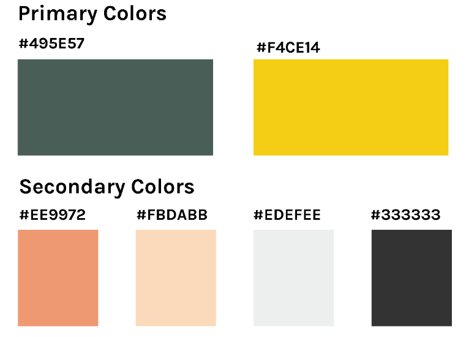
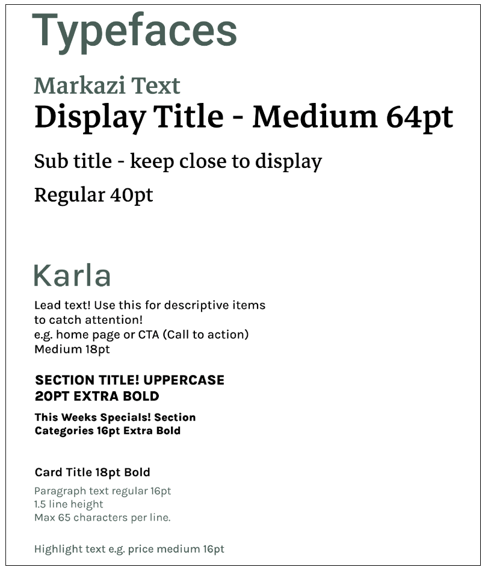

## Table of Contents

- [User Experience (UX)](#user-experience-ux)
  - [User Stories](#user-stories)
  - [Agile Methodology](#agile-methodology)
  - [Design](#design)
    - [Wireframes](#wireframes)
    - [Color Scheme](#color-scheme)
    - [Typography](#typography)
- [Features](#features)
  - [Home Page](#home-page)
  - [Navigation](#navigation)
  - [Components](#Components)
    - [Components used in this application](#Components-used-in-this-application)
- [Testing](#testing)
  - [User Story Testing](#user-story-testing)
  - [Bugs](#bugs)
    - [Fixed Bugs](#fixed-bugs)
    - [Remaining Bugs](#remaining-bugs)
- [Technologies Used](#technologies-used)
  - [Languages and Frameworks Used](#languages-and-frameworks-used)
  - [Node Packages / Dependencies Used](#node-packages--dependencies-used)
  - [Programs and Tools Used](#programs-and-tools-used)
- [Deployment](#deployment)
  - [Forking the GitHub Repository](#forking-the-github-repository)
  - [Making a Local Clone](#making-a-local-clone)
- [Credits](#credits)
  - [Acknowledgments](#acknowledgments)

### Wireframes

Click to open

 

### Color Scheme

Click to open

 

### Typography

Click to open

 